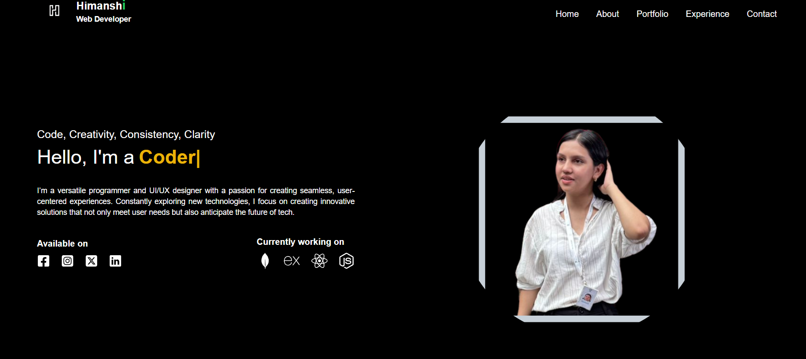

# Portfolio Website

This is my personal portfolio website built using **React + Vite** and styled with **Tailwind CSS**.

## 🚀 Preview



## 🛠 Tech Stack

- **React**
- **Vite**
- **Tailwind CSS**

## 📂 Project Setup

1. Clone the repository:
   ```bash
   git clone https://github.com/himanshii7/SamplePortfolio.git
   cd your-repo
   ```
2. Install dependencies:
   ```bash
   npm install
   ```
3. Start the development server:
   ```bash
   npm run dev
   ```

## 📦 Build for Production

To create a production build, run:
```bash
npm run build
```

## 🌟 Features
- Responsive design
- Modern UI with Tailwind CSS
- Optimized with Vite


